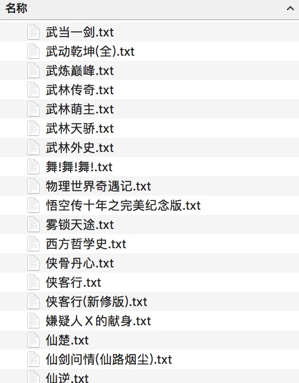
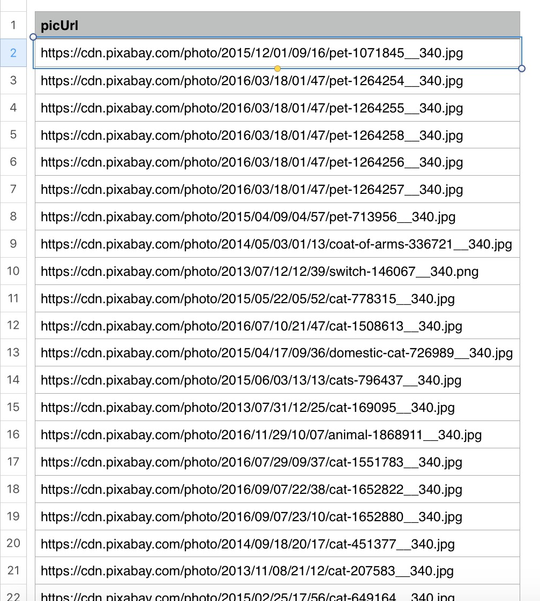

##爬取小说小爬虫
60行代码爬取某小说网站800本小说，使用scrapy框架，存取为txt文件，因为scrapy的feed output没有.txt，所以文件写入部分需要自己写。（程序运行过程因为最开始并发线程太多，而没有设置延迟致使这个网站一度奔溃。）

##图片爬取小爬虫
从国外网站获取10000+猫咪图片的地址，因为下载速度原因没有下载。使用scrapy框架，加上锁进总共26行。

	
